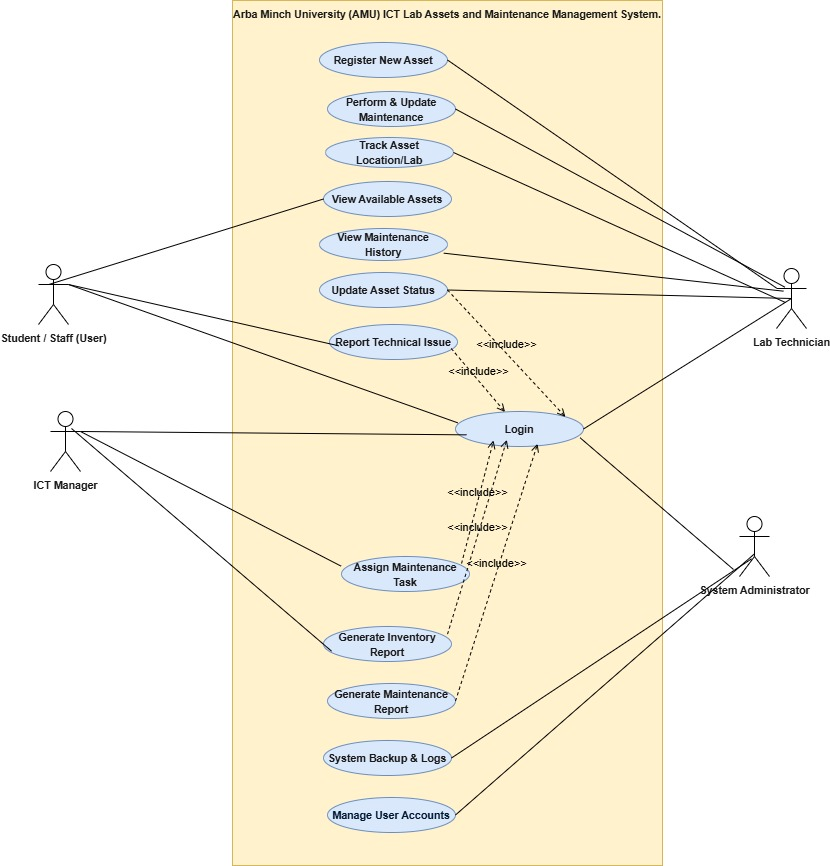
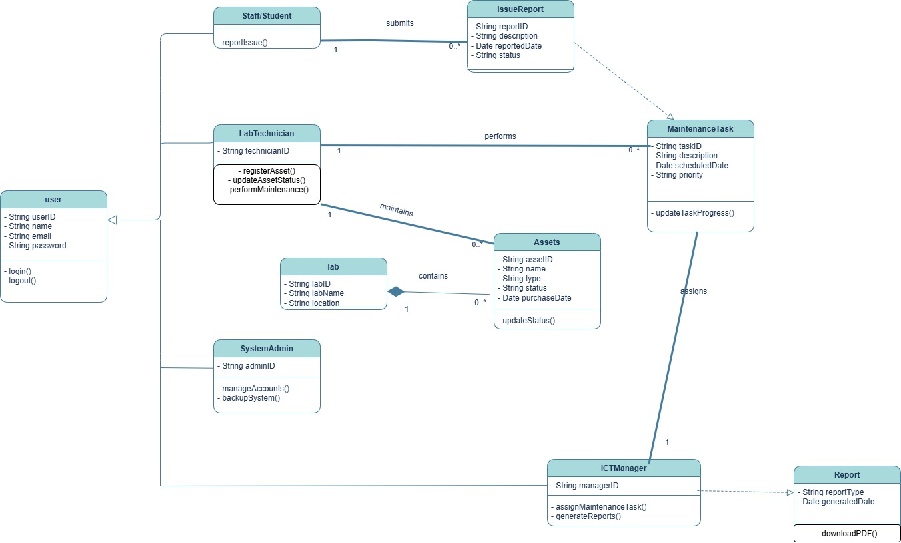
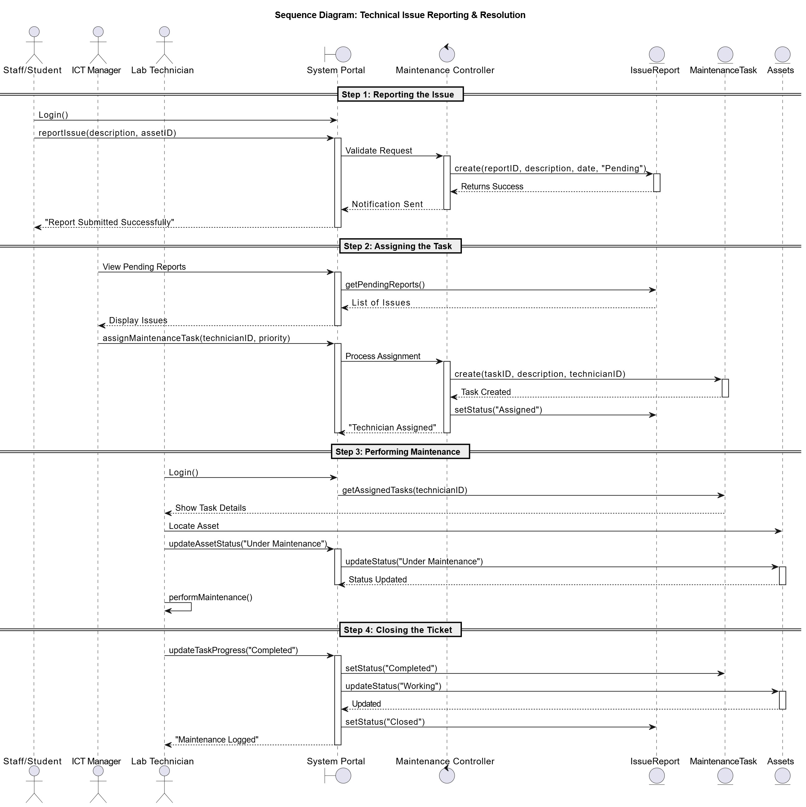
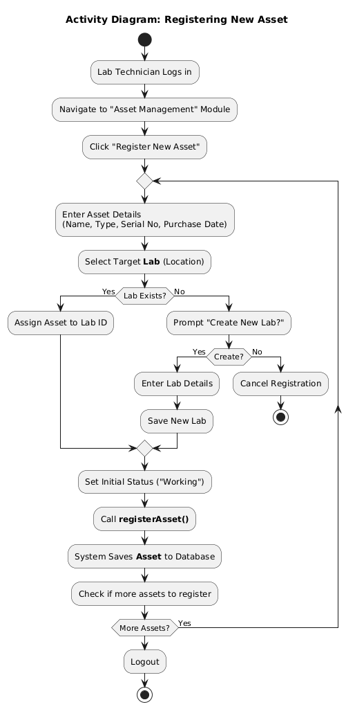

# 🎓 AMU ICT Asset Maintenance System - Group Project

## 📋 Project Overview
This repository contains the source code and documentation for the **Arba Minch University ICT Asset Maintenance System**. The system is designed to handle asset registration, maintenance tracking, and issue reporting to improve the reliability of the university's infrastructure.

The project uses **Java** for the structural logic and **UML** (Unified Modeling Language) for the system design.

---

## 👥 Group Members & Contributions

| Name | ID No. | 🛠️ Role & Contribution |
| :--- | :--- | :--- |
| **Kibra G/Tsadkan** | NSR/556/16 | 📐 **System Modeling** (UML Design & Diagram Creation) |
| **Eyob Weldetensay** | NSR/339/16 | 👤 **User Module** (Implemented User & Technician Classes) |
| **Abeje Goshu** | NSR/017/16 | 💻 **Asset Module** (Implemented Asset & Issue Report Logic) |
| **Ahmed Hussen** | NSR/069/16 | 👔 **Manager Module** (Implemented Management & Admin Functions) |
| **Naol Birhanu** | NSR/753/16 | 📝 **Integration** (Main Entry Point, Documentation & Final Report) |

---

## 📂 How to Navigate This Repo
*   **📂 docs/**: Contains all the system UML diagrams (PNG images).
*   **📂 src/**: Contains the Java source code (`.java` files).
*   **📄 Report:** The final project documentation is available as a `.docx` file in the root directory.

---

## 📊 System Diagrams

### 1. 🎭 Use Case Diagram
**Description:** 
The Use Case diagram below shows the four main actors: **Student, Manager, Technician, and Admin**. It highlights how they interact with the system, such as a Student reporting an issue or a Technician updating asset status.

----

### 2. 🏗️ Class Diagram
**Description:**
This structural diagram defines the blueprint of our system. It shows the `User` superclass and how `LabTechnician` and `ICTManager` inherit from it. It also details the relationship between `Labs` and `Assets`.

----

### 3. ⏱️ Sequence Diagram
**Description:**
This diagram visualizes the flow of logic when a user reports a broken item. It traces the steps from the UI (User Interface) to the Database and back to confirm the action.

---

### 4. ⚡ Activity Diagram
**Description:**
This shows the step-by-step workflow of a Technician registering a new computer. It includes decision points, such as checking if a Lab exists before assigning the asset.

